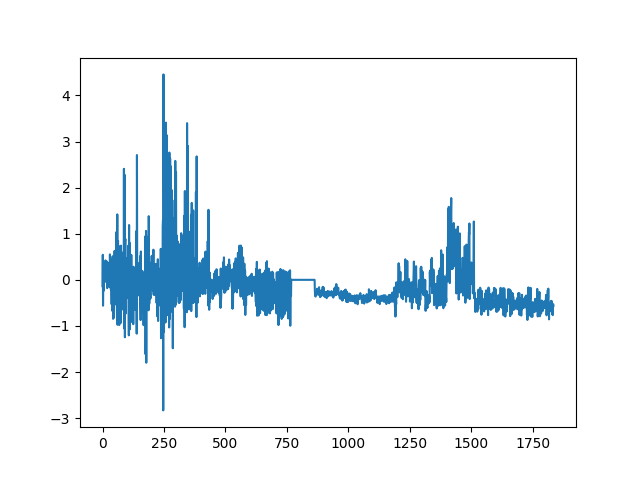
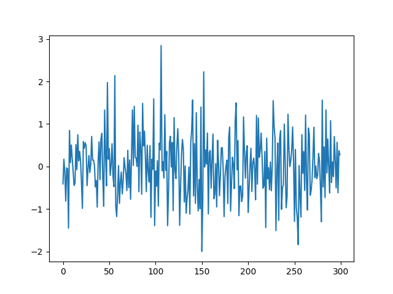
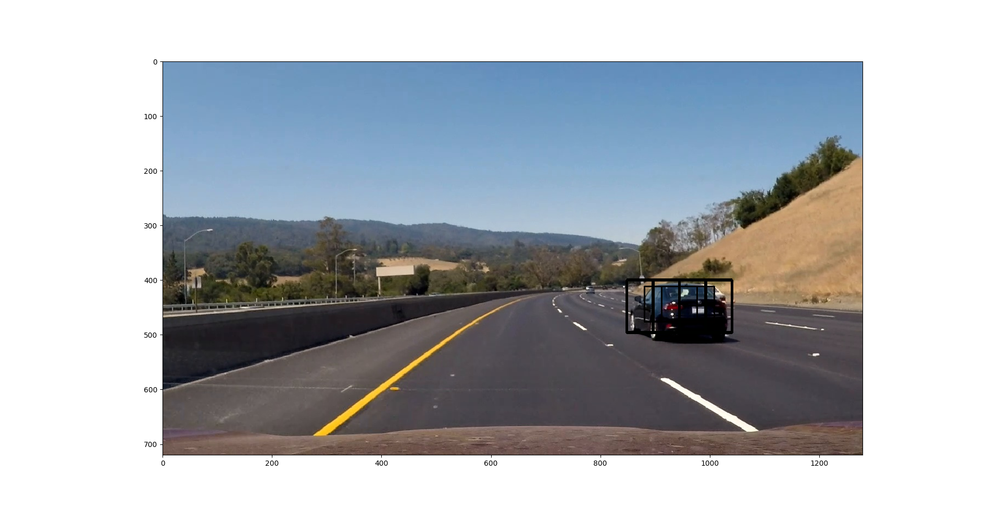
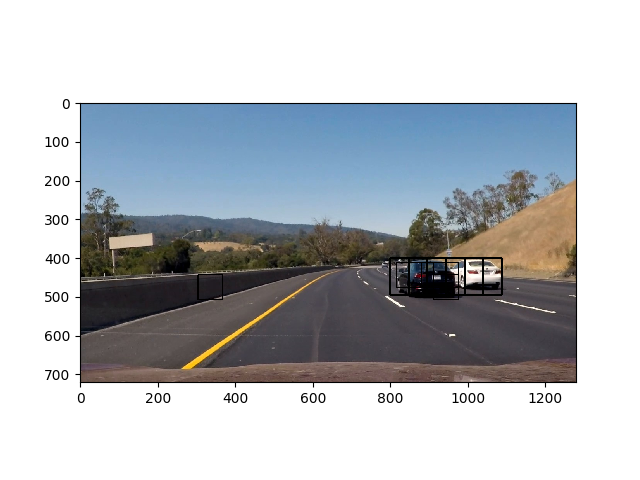
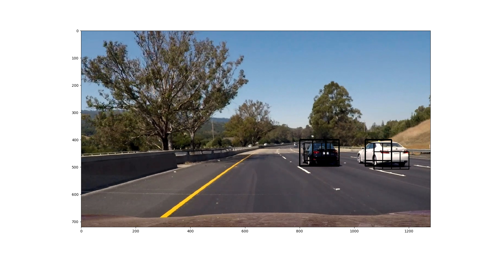
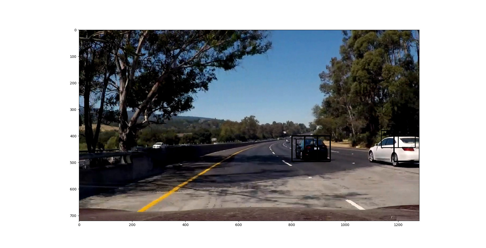

# Vehicle Detection and Tracking Project

## Useful information

Project goals/checkpoints:
- construct a pipeline for processing video frames;
- the pipeline must properly and accurately detect lane markings on the road, 
regardless of shadows and changes in lightning conditions;
- test the pipeline on a set of example images and detect the lane accurately
- detect and calculate lane curvature and lane circle radius
- after testing, proceed and export a video file with the above information overlaid
on top of the video stream.

## Files of interest
- [main.py](./main.py) - this is what is supposed to be run to fully process video
- [data_manipulation.py](./data_manipulation.py) - feature extraction, color preprocessing functions, etc. in a single file
- [heatmap_utils.py](./heatmap_utils.py) - heatmap class and utilities (functioning as a time-series filter for the algorithm)

---

## Image processing Pipeline

The vehicle detection pipeline used in this project will be assessed here. (Almost) 
The same pipeline used to detect vehicles in a single image is used to detect 
vehicles in video frames as well.

### Histogram of Oriented Gradients (HOG)

The main point for using a HOG feature vector for this classifier is the fact that I can quickly and easily 
test and choose the best option for detecting cars on the road, compared to neural networks which require more training
before use. As with most other projects until now, I started with the default (suggested) configuration for the HOG 
feature extractor and took it from there. I experimented with color space, number of orientations and pixels per cell 
until I settled down with the values given in the following table.

| Parameter | Chosen value |
|-----------|-------|
| Color space | YUV |
| Orientations | 9 |
| Pixels per cell | 16 |
| Cells per block | 2 |
| HOG from channel | ALL |

Exploring further on the Internet, it seems that projects varied the numbers to achieve (what seems to be) 
a similar result.The motivation to use the presented parameter value combination is as much the accuracy with which it detects vehicles,
as is the (relatively) small feature vector size per image channel. After testing, this combination proved to be accurate enough, 
while keeping a smaller number of overall HOG feature vector points in the final feature vector. 

What I also found out is that images containing road parts tend to result in similar HOG outputs, compared to the variety 
of outputs which we get from blurry and sharp images from cars' rear parts. This leads me to believe that we're training 
a classifier which decides primarily if the given area is NOT a road, and then whether it is a car.

The HOG feature extraction can be found in lines 97-108 (implementation) inside [data_manipulation.py](./data_manipulation.py).
The function performing the HOG feature extraction can be found in the same file under the name `get_hog_features`, 
starting at line 21.

### Other notable preprocessing steps

Here I'll mention other preprocessing steps which can be found in the image pipeline.

To reduce the influence of big values on some data axis from the feature vector in the classifier, the data was scaled and 
normalized using SKLearn's Standard Scaler. What's more, since the training process was done on a list of .png file-format 
images, and we were doing predictions on .jpg photos in the video and image pipeline, each input image/frame was being 
re-mapped from 0 - 255 to 0.00 - 1.00 in order to get good predictions and work with the same data scales in the classifier.

To further help lower the length of the feature vector for our SVM classifier with rbf kernel, I used a technique called 
Principal Component Analysis (PCA) on a normalized (scaled) feature vector dataset. The technique analyzed the training 
data and extracted the top 300 components with the greatest variance (also called principal components). The idea to do this 
 came from Sebastian Raschka's Python Machine Learning, 1st Ed. book. This analysis' results should speed up the 
 training process, lower the amount of RAM used in the system, and provide us with a much smaller 300-element arrays (vectors) 
 for training our SVM classifier, while keeping the components that differentiate cars and not-cars the most.
 

 
A sample feature vector is given here (before PCA analysis, ~1750 components).
 

The same feature vector after PCA analysis (300 components).

### Sliding Window Search

A classifier won't do much on its own in this project, because we have to supply image regions for it to predict the 
presence of a car in them. To do this, I implemented a sliding window search using three different squared window sizes.
The search window sizes are given in the following table:

| Window | Size | Search area (xmin, xmax, ymin, ymax) |
|-----------|-------|-------|
| Small | 64 x 64 px | 80, 1280, 380, 520 |
| Medium | 96 x 96 px | 80, 1280, 400, 550 | 
| Large | 128 x 128 px | 80, 1280, 470, 600 |

The third column in the table gives us the region of interest, or search area for each window size and image. 
Because our region of interest doesn't span the whole picture (for example, we wouldn't like to look for cars in the sky, 
or vegetation areas), I limited the zone in which the sliding window search is done. Each of the window sizes uses its 
own search region - the search regions overlap. 

I adjusted each window size and search region according to the reasonable size of a car shown on a photo in that region.
This means that smaller windows would look 'farther' on the road in order to detect cars when compared to bigger sized 
search windows, which would aim to detect vehicles closer to our car. Overlapping of each zone was introduced to 
increase the certainty of a car being present in a given image region, since multiple detections could (and would) overlap. 

Here I will give three examples of the detections:

I decided not to force too small (eg. 32x32px) or too large (eg. 320x320px) search windows into the pipeline.
The rationale behind my decision is the following:
- cars fitting the very small window as suggested in the example would be too far away, and probably blurry enough not to be 
making a difference in the HOG extraction step, causing insecurity for the classifier and risking false positives
- windows which are too big may include more than just road or cars inside, like vegetation, curbs and other features,
which might trick the classifier into thinking that a car is present if the HOG and color feature components 
don't quite align with those of 'open roads'. What's more, if a car was detected in any case inside such a big window, it 
means that it is too close to our vehicle. In such cases, the smaller windows may have detected the car already, so no 
much would be gained for the required time complexity.

Since cars don't just 'materialize' in front of a vehicle without previously been detected in consecutive frames, a 
filter to remove one-off detections and false positives was added to the pipeline.
To ensure that the pipeline would detect as few false positives as possible, apart from the normalization and component analysis steps, 
I implemented a time-series heatmap (filter) for consecutive video frames. This filter (in code referred to as 'heatmap history') 
holds the detection maps for the last 10 frames of the video. These 10 detection maps (or 'heatmaps') are summed up and 
thresholded to ensure that outliers or false positives are rejected if they don't appear in 10 consecutive frames.

## Video implementation

The video pipeline follows the steps for examining a single image as described previously. The final video output can be 
seen [here](./generated_project_video.mp4).

To combine overlapping bounding boxes for each frame, I used the previously mentioned heatmap filter to threshold and 
isolate the areas with the greatest certainty of a car being present in the image. Afterwards, I used SKImage's label 
function in [main.py, lines 153-161](./main.py) to separate each detected region in the image and draw a bounding box 
around it for each video frame.

The resulting pipeline detects very few false positives and successfully tracks neighbouring vehicles.

## Discussion

This discussion includes some consideration of problems/issues faced, what could be 
improved about their algorithm/pipeline, and what hypothetical cases would cause 
their pipeline to fail.

Probably the biggest problem which I faced is the sheer amount of time and resources the pipeline uses for the detection 
process. The sliding window search technique requires that each window is resized, then features extracted, 
normalized and finally the feature vector is run through a classifier to get a prediction. This involves a lot of matrix 
multiplication operations which take a lot of time on a CPU, thus crossing out the possibility of a real-time detection 
and tracking pipeline with the current method (as implemented). What's more, the SVM classifier uses more than 4500 
support vectors for just a binary classifier (numerically ~40% of the total amount of vectors used for training and testing), 
which complicates the system!

The second biggest problem is the great similarity among the dataset's datapoints (images). Since the images are 
extracted from videos, many times one and the same car is present more than 4 times in the training data. This leads to 
two possible problems:
1. The classifier tends to overfit the data, as the samples given to it are very similar to one another
2. The test result for predictions over the test-set is not reliable or true to real-life performance, since almost the same data 
was previously seen during training. Those 99,9% obtained in the test phase may not feel so good after all...

These problems were almost fully solved by manually cleaning up the given dataset. In the future, a similarity score can be 
given to an image pair via software in order to remove such images and do the same process much faster and more reliably.

Something which is also worth mentioning is the very small amount of pictures of car's sides. This anomaly of the dataset 
is noticeable in the videos the most, especially when the white car to our car's right is moved halfway out-of-frame. When 
our classifier can't register the rear lights or number plate shapes in a car, it becomes far more unreliable. This can 
be improved by adding more side images of cars to the dataset and further balancing the dataset. What's more, even though 
the pipeline can detect cars coming from the opposite direction, a bigger dataset is needed for that to really work. 
Here's an example of an unreliable detection in one case as discussed:

I am not so thrilled to suggest running this pipeline in real-time, or at night/ in extremely low light / bad weather 
(heavy rain), as the dataset features pictures of cars almost exclusively taken in broad daylight. This can be 
 mitigated by sourcing night-time / bad weather dashcam videos, then adding more images to this dataset, or agumenting 
 the images to simulate bad weather conditions, low visibility etc. (for example, using gray image additions as overlays 
 with 10-50% opacity over the original test images to simulate fog). 
 This pipeline is also sluggish when it comes to real-time processing,  so some tweaking must be done to ensure faster processing times.
